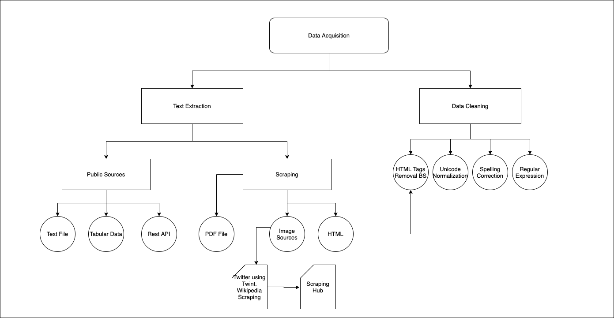

# Contents

1. What is Data Acquisition?
2. Sources to use a public dataset - ucmachinelearning, kaggle, google datasets, hugging face datasets
6. Text Extraction: Text file, Tabular Data, Rest API (Tweet of the day)
3. Scraping Data
4. Scraping Data : Wikipedia Tutorial , Beautiful Soup
4. Text extraction and Cleanup: HTML Parsing
10. Scraping Data: Twint for Twitter
5. Text Cleaning: Unicode Normalization
6. Text Extraction: PDF
7. Text Extraction: Image (Tesseract)
8. Text Cleaning: Spelling Correction
9. Scraping Hub Tutorial
10. Regular Expression for cleaning

